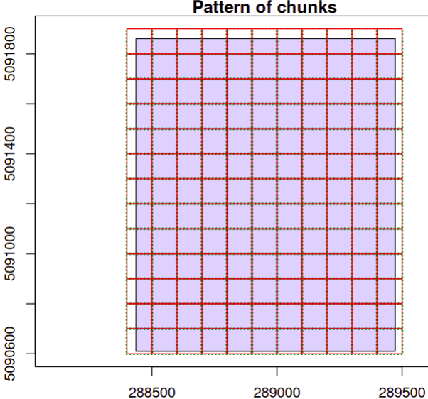
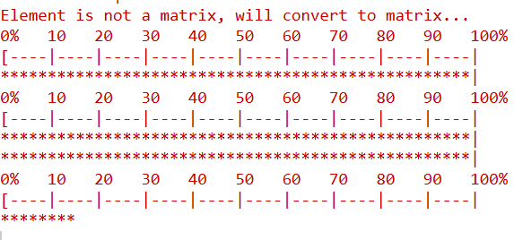

# Benchmark SIFET 2025

**“Classificazione di nuvole di punti da drone”**

Francesco Pirotti, Enrico Magazzino

*CIRGEO Centro Interdipartimentale di Ricerca di Geomatica / TESAF Dipartimento Territorio e Sistemi Agroforestali, Università di Padova*

## Obiettivi

Suddividere i punti rilevati con sensore laser scanner L2 in parti omogenee (segmenti o oggetti), in base a criteri estratti dalle variabili dispoinibili.

## Materiale

Il benchmark mette a disposizione diversi prodotti da rilievo con drone con camere RGB, multispettrali e LiDAR su una zona agricola

## Metodi

Descrittori geometrici da intorno di 50 cm e 1 m estratti con 32 CPU. I descrittori geometrici sono noti da letteratura e sono qui estratti con la libreria [R "CloudGeometry"](https://github.com/fpirotti/CloudGeometry) disponibile su Github. Questa libreria sfrutta la capacità di utilizzo del calcolo parallelo multi-CPU dei moderni calcolatori. Questo passaggio è fondamentale dato il numero elevato di punti (\> 1e9 ).

{width="302"}

I descrittori sono stati scalati e trasformati rispetto alla loro mediana ed alla loro deviazione standard in quanto spesso non seguono una distribuzione nornale . The standard mathematical **symbol for the median** is:

$$
z = \frac{x - \tilde{x}}{\text{MAD}(x)}
$$

$$  
\quad \text{dove} \quad \tilde{x} = \text{mediana}(x)
$$

La segmentazione viene poi eseguita con il metodo K-means su queste variabili e aggiungendo RGB. Vengono imposte 10 diversi cluster.

## Risultati

I dati sono visibili online [QUI](https://www.cirgeo.unipd.it/pointclouds/sifetBenchmark2025/).

La nuvola dopo segmentazione è disponibile per download QUI.

## Discussione
