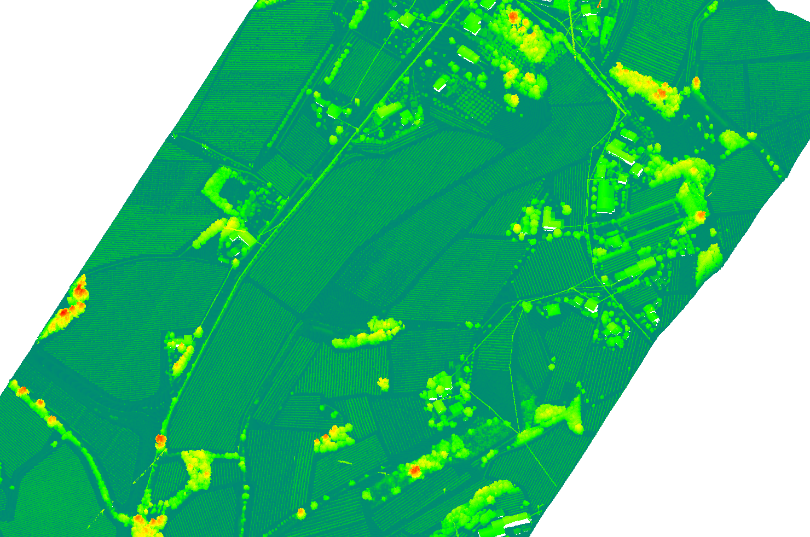

# Benchmark 66° Convegno Annuale SIFET 2025

**“Classificazione di nuvole di punti da drone”**

Francesco Pirotti, Enrico Magazzino

*CIRGEO Centro Interdipartimentale di Ricerca di Geomatica / TESAF Dipartimento Territorio e Sistemi Agroforestali, Università di Padova*

## Obiettivi

L'obiettivo del benchmark è di:

======================

"testare e validare metodologie efficaci e replicabili di segmentazione 
automatica e/o assistita di nuvole di punti acquisite da sensori montati su aeromobili a pilotaggio remoto (APR).

L’utente è invitato a proporre metodi innovativi e/o consolidati in grado di classificare e segmentare le nuvole di
punti in modo efficace e replicabile, con particolare attenzione alla distinzione di oggetti (vegetazione, edifici,
suolo, infrastrutture, ecc.).

======================

In questo test si procede unicamente ad una fase di segmentazione, senza la parte di classificazione, ovvero l'obiettivo specifico è di suddividere i punti rilevati con sensore laser scanner in parti omogenee (segmenti o oggetti), in base a criteri estratti dalle variabili disponibili.

I punti di nota del lavoro sono:

- vengono usate unicamente le coordinate di punti XYZ, non vengono considerate
intensità, numero di ritorno e altri attributi tipici di un rilievo lidar

- viene elaborata tutta la nuvola di punti con diverse strategie per considerare
la velocità di elaborazione come fattore importante nelle decisioni finali 
dell'approccio da adottare


## Materiali

### Dati utilizzati

Il benchmark mette a disposizione diversi prodotti da rilievo con drone con camere RGB, multispettrali e LiDAR su una zona agricola. La nuvola di punti contiene 1'248'152'076 (1.25 x 10\^9) punti.

La procedura di segmentazione assistita viene implementata usando  solo la nuvola di punti e descrittori geometrici estratti dalle coordinate XYZ.


### Software

Per la procedura di segmentazione vengono utilizzati quasi tutti algoritmi e applicativi a codice aperto (open source - OS) di ultima generazione, "chiamati" in una procedura in ambiente R per uniformare il processo. In particolare vengono usati Lastools, lasR, LidR, CloudGeometry e H2O.

Per la procedura di creazione dell'ortoimmagine multispettrale è stato utilizzato Metashape-pro.

### Capacità di calcolo

Per l'elaborazione viene usato un calcolatore assemblato SuperMicro, con le seguenti caratteristiche:

::: list
-   CPU(s): 384

-   Model name: AMD EPYC 9654 96-Core Processor

-   CPU family: 25

-   Model: 17

-   Thread(s) per core: 2

-   Core(s) per socket: 96

-   CPU max MHz: 3707.8120

-   CPU min MHz: 1500.0000

-   BogoMIPS: 4800.10

-   Memory: total: 770 GiB
:::

### Area di studio

In figura sotto l'area di studio.


## Metodi

L'obiettivo è la segmentazione, realizzata in modalità semi-automatica, mediante la suddivisione dei punti in cluster sulla base delle loro caratteristiche distintive.

Per semiautomatica si intende che non richiede interventi manuali di addestramento 
tipi invece delle procedure guidate. Gli unici parametri da utilizzare sono quello per la definizione di un modello digitale del terreno e il raggio per definire i 
descrittori geometrici. Il primo è facilmente identificabile con il tipo di terreno
(in forte pendenza o in piano, con grandi edifici o privo di grandi edifici). Il 
secondo dipende dal passo medio tra punti (densità dei punti) ed è facilmente 
identificabile.

L'unità elementare utilizzata per la segmentazione è il singolo punto della nuvola di punti. L’ipotesi oggetto di verifica è che, basandosi esclusivamente sulle informazioni geometriche rilevate dal sensore L2 — senza ricorrere a dati di riflettanza aggiuntivi né a procedure di addestramento supervisionato — sia possibile suddividere i punti in gruppi (cluster) utili per una successiva classificazione o, quantomeno, per una più approfondita comprensione del territorio.

Tutti i passaggi sono documentati nel codice del file [01_processBenchmark](https://github.com/fpirotti/benchmarkSIFET2025/blob/main/01_processBenchmark.R)

###  Estrazione dei punti terreno e modello digitale del terreno


La prima fase del processo ha previsto l’identificazione dei punti appartenenti al 
terreno. A tal fine, è stato creato un dataset ricampionato della nuvola di punti, 
con un passo spaziale di circa 0,5 m, mantenendo per ciascun quadrato di griglia il 
punto con valore Z minimo. Su questa nuvola ricampionata è stata quindi applicata 
una classificazione per distinguere i punti "terreno" ("ground") dagli altri. I
punti identificati come terreno sono stati utilizzati per calcolare la coordinata altimetrica normalizzata rispetto alla superficie del suolo (nZ).
A conclusione di questa fase, sono stati prodotti: (i) un raster a risoluzione 0,5 m
contenente le quote del terreno; (ii) una nuvola di punti contenente esclusivamente 
i punti classificati come terreno.

### Voxelizzazione  

La nuvola di punti è stata successivamente normalizzata spazialmente tramite una voxelizzazione con celle tridimensionali di 0,2 m. Per ciascun voxel, è stato calcolato un punto rappresentativo, ottenuto come media delle coordinate e degli attributi di tutti i punti contenuti nella cella. Questo passaggio ha lo scopo di uniformare la distribuzione spaziale della nuvola, riducendo le variazioni locali di densità che potrebbero compromettere l’affidabilità del calcolo di alcuni descrittori geometrici.

La nuvola di punti ottenuta tramite la procedura di voxelizzazione presenta una densità più omogenea e un numero di punti gestibile per le successive elaborazioni. Su questa nuvola è stata eseguita l’estrazione di 15 descrittori geometrici mediante la libreria R sviluppata ad hoc  [R "CloudGeometry"](https://github.com/fpirotti/CloudGeometry) disponibile su Github. Come descritto nella documentazione del progetto su GitHub, la libreria calcola i descrittori attraverso combinazioni di autovalori e componenti principali (PCA) ottenuti dalle coordinate X, Y e dalla quota normalizzata (nZ). I descrittori sono calcolati in questo caso considerando l’intorno di ciascun punto entro due raggi differenti: 0.5 m e 1 m. Questi raggi per identificare i punti vicini sono ragionevoli considerando il passo di 0.2 dei voxel.

L’elaborazione è stata effettuata in parallelo sfruttando 32 CPU simultaneamente, grazie al supporto al calcolo parallelo offerto dalla libreria. Questo approccio è essenziale per gestire l’elevato numero di punti e la necessità di valutare, per ciascun punto, i vicini contenuti nel raggio definito.  

 Fig. 1 - elaborazione descrittori geometici.

### Normalizzazione

I descrittori sono stati scalati e trasformati rispetto alla loro mediana ed alla loro deviazione calcolata mediante MAD (median absolute deviation) in quanto molti non seguono una distribuzione normale e questo approccio limita l'effetto di distribuzioni fortemente asimmetriche. L'espressione per trasformare il vettore $X$ di $i$ valori $X = \{x_1, x_2, ..., x_i\}$ è la seguente:

$$
z = \frac{x - \tilde{x}}{\text{MAD}(X)}
$$

$$  
\quad \text{dove} \quad \tilde{x} = \text{mediana}(X) 
$$

La segmentazione viene poi eseguita con il metodo K-means su queste variabili 
trasformate.

### K-Means

K-Means è un approccio di segmentazione. Clusterizza un numero di punti sceglie casualmente i punti di inizio nello spazio ad n-dimensioni dove n = il numero di variabili (nel nostro caso 31, ovvero 30 metriche di geometria, 15 per ogni con raggio utilizzato, e 1 dall'altezza dei punti rispetto al terreno. 

Il metodo converge verso un minimo locale dei centroidi. Il numero di cluster è arbitrario e dovrebbe essere considerato come un parametro da impostare. In questa prova vengono utilizzati 10 cluster. Il risultato è una matrice che contiene le assegnazioni ai cluster e le coordinate nello spazio n-dimensionale dei centri dei cluster in termini degli attributi originariamente selezionati.  

## Risultati

La nuvola di punti segmentata è visibile [QUI](https://github.com/fpirotti/benchmarkSIFET2025/blob/main/data/out/VOXnormGeomCluster.laz)

Il cluster di ogni punto è disponibile nella sezione del formato ASPRS LAS di attributi "extra byte" in formato 8bit nell'attributo cluster.

La fase di conversione in voxel e di calcolo della nZ ha prodotto una nuvola di 45e6 punti visibile sotto tematizzata per nZ

<div style="float:left;">

</div>

<br>
Fig. 2 - nuvola di punti normalizzata a voxel. Fig. 3 - risultato segmentazione in 10 classi

 Fig. 4 - risultato segmentazione in 10 classi

```         
0     1     2     3     4     5     6     7     8     9    
0.256 0.002 0.064 0.027 0.169 0.043 0.076 0.146 0.029 0.187
```

Tab. 1 - distribuzione di frequenza dei cluster (totale 1)

## Discussione

Nel procedimento sono stati notati molti limiti nell'utilizzo di alcuni algoritmi implementati unicamente su R usando lidR e lasR. In primis lidR carica in un data.frame R i dati, ovvero in una struttura non ottimizzata. La libreria lasR invece utilizza quasi esclusivamente l'ambiente di memoria C++ dunque viene gestito meglio. Lastools invece sfrutta al meglio la capacità di calcolo parallelo, senza complicazioni dovute ad alcune strategie di condivisione della memoria utilizzate da R. Lastools viene lo stesso usato tramite R chiamando il programma con il comando *system*. L'utilizzo di alternative, per rendere il flusso di processo totalmente OS, è sicuramente da verificare, con adeguata attenzione all'implementazione di ogni singolo algoritmo per quanto riguarda l'utilizzo della memoria per ogni processo eseguito in parallelo.

Riguardo i descrittori geometrici, è utile riportare che questi sono disponibili anche in altri applicativi, come CloudCompare, ed anche nel recente sviluppo di lidR nel nuovo lasR ([Jean-Romain Roussel 2025](https://r-lidar.github.io/lasR/)), ma nel primo caso verrebbe richiesto un'integrazione tra applicativi differenti (R e CloudCompare), certamente possibile ma con aggiunta complessità, mentre nel secondo caso sono state testate le procedure ma non hanno l'implementazione interna per il calcolo parallelo che ha CloudGeometry, dunque i tempi di calcolo diventavano non compatibili (un file di 1e6 punti richiede 3 ore), e la gestione di eventuali elaborazioni parallele di più files non ha avuto successo, almeno dalle prove.
