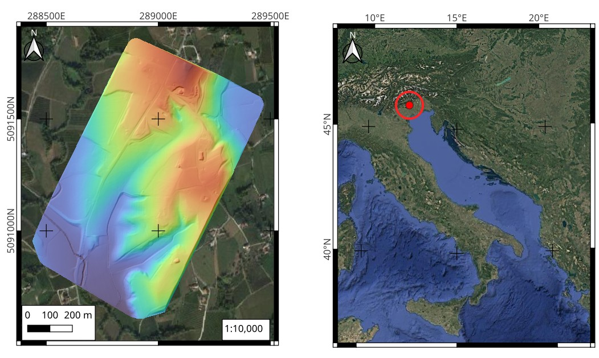
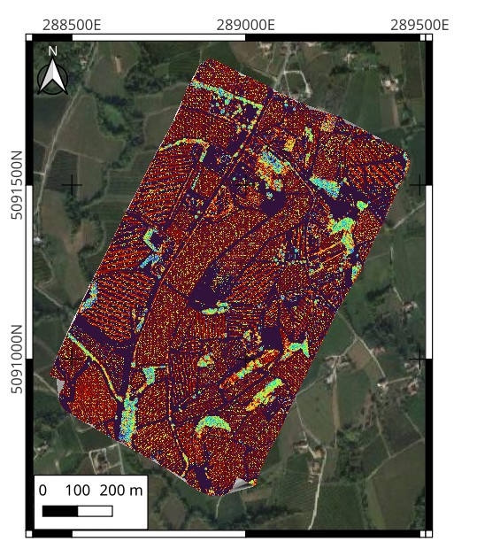

# Obiettivi

L'obiettivo del benchmark è di:

======================

"testare e validare metodologie efficaci e replicabili di segmentazione automatica e/o assistita di nuvole di punti acquisite da sensori montati su aeromobili a pilotaggio remoto (APR).

L’utente è invitato a proporre metodi innovativi e/o consolidati in grado di classificare e segmentare le nuvole di punti in modo efficace e replicabile, con particolare attenzione alla distinzione di oggetti (vegetazione, edifici, suolo, infrastrutture, ecc.).

======================

In questo test si procede unicamente ad una fase di segmentazione, senza la parte di classificazione, ovvero l'obiettivo specifico è di suddividere i punti rilevati con sensore laser scanner in parti omogenee (segmenti o oggetti), in base a criteri estratti dalle variabili disponibili.

I punti di nota del lavoro sono:

-   vengono usate unicamente le coordinate di punti XYZ, non vengono considerate intensità, numero di ritorno e altri attributi tipici di un rilievo lidar

-   viene elaborata tutta la nuvola di punti con diverse strategie per considerare la velocità di elaborazione come fattore importante nelle decisioni finali dell'approccio da adottare

# Materiali

## Dati utilizzati

Il benchmark mette a disposizione diversi prodotti da rilievo con drone con camere RGB, multispettrali e LiDAR su una zona agricola. La nuvola di punti contiene 1'248'152'076 (1.25 x 10\^9) punti.

La procedura di segmentazione assistita viene implementata usando solo la nuvola di punti e descrittori geometrici estratti dalle coordinate XYZ.

## Software

Per la procedura di segmentazione vengono utilizzati quasi tutti algoritmi e applicativi a codice aperto (open source - OS) di ultima generazione, "chiamati" in una procedura in ambiente R per uniformare il processo. In particolare vengono usati Lastools, lasR, LidR, CloudGeometry e H2O.

Per la procedura di creazione dell'ortoimmagine multispettrale è stato utilizzato Metashape-pro.

## Capacità di calcolo

Per l'elaborazione viene usato un calcolatore assemblato SuperMicro, con le seguenti caratteristiche:

::: list
-   CPU(s): 384

-   Model name: AMD EPYC 9654 96-Core Processor

-   CPU family: 25

-   Model: 17

-   Thread(s) per core: 2

-   Core(s) per socket: 96

-   CPU max MHz: 3707.8120

-   CPU min MHz: 1500.0000

-   BogoMIPS: 4800.10

-   Memory: total: 770 GiB
:::

## Area di studio

In figura sotto l'area di studio.

 

# Metodi

L'obiettivo è la segmentazione, realizzata in modalità semi-automatica, mediante la suddivisione dei punti in cluster sulla base delle loro caratteristiche distintive.

Per semiautomatica si intende che non richiede interventi manuali di addestramento tipi invece delle procedure guidate. Gli unici parametri da utilizzare sono quello per la definizione di un modello digitale del terreno e il raggio per definire i descrittori geometrici. Il primo è facilmente identificabile con il tipo di terreno (in forte pendenza o in piano, con grandi edifici o privo di grandi edifici). Il secondo dipende dal passo medio tra punti (densità dei punti) ed è facilmente identificabile.

L'unità elementare utilizzata per la segmentazione è il singolo punto della nuvola di punti. L’ipotesi oggetto di verifica è che, basandosi esclusivamente sulle informazioni geometriche rilevate dal sensore L2 — senza ricorrere a dati di riflettanza aggiuntivi né a procedure di addestramento supervisionato — sia possibile suddividere i punti in gruppi (cluster) utili per una successiva classificazione o, quantomeno, per una più approfondita comprensione del territorio.

Tutti i passaggi sono documentati nel codice del file [01_processBenchmark](https://github.com/fpirotti/benchmarkSIFET2025/blob/main/01_processBenchmark.R)

## Estrazione dei punti terreno e modello digitale del terreno

La prima fase del processo ha previsto l’identificazione dei punti appartenenti al terreno. A tal fine, è stato creato un dataset ricampionato della nuvola di punti, con un passo spaziale di circa 0,5 m, mantenendo per ciascun quadrato di griglia il punto con valore Z minimo. Su questa nuvola ricampionata è stata quindi applicata una classificazione per distinguere i punti "terreno" ("ground") dagli altri. I punti identificati come terreno sono stati utilizzati per calcolare la coordinata altimetrica normalizzata rispetto alla superficie del suolo (nZ). A conclusione di questa fase, sono stati prodotti: (i) un raster a risoluzione 0,5 m contenente le quote del terreno; (ii) una nuvola di punti contenente esclusivamente i punti classificati come terreno.

## Voxelizzazione

La nuvola di punti è stata successivamente normalizzata spazialmente tramite una voxelizzazione con celle tridimensionali di 0,2 m. Per ciascun voxel, è stato calcolato un punto rappresentativo, ottenuto come media delle coordinate e degli attributi di tutti i punti contenuti nella cella. Questo passaggio ha lo scopo di uniformare la distribuzione spaziale della nuvola, riducendo le variazioni locali di densità che potrebbero compromettere l’affidabilità del calcolo di alcuni descrittori geometrici.

La nuvola di punti ottenuta tramite la procedura di voxelizzazione presenta una densità più omogenea e un numero di punti gestibile per le successive elaborazioni. Su questa nuvola è stata eseguita l’estrazione di 15 descrittori geometrici mediante la libreria R sviluppata ad hoc [R "CloudGeometry"](https://github.com/fpirotti/CloudGeometry) disponibile su Github. Come descritto nella documentazione del progetto su GitHub, la libreria calcola i descrittori attraverso combinazioni di autovalori e componenti principali (PCA) ottenuti dalle coordinate X, Y e dalla quota normalizzata (nZ). I descrittori sono calcolati in questo caso considerando l’intorno di ciascun punto entro due raggi differenti: 0.5 m e 1 m. Questi raggi per identificare i punti vicini sono ragionevoli considerando il passo di 0.2 dei voxel.

L’elaborazione è stata effettuata in parallelo sfruttando 32 CPU simultaneamente, grazie al supporto al calcolo parallelo offerto dalla libreria. Questo approccio è essenziale per gestire l’elevato numero di punti e la necessità di valutare, per ciascun punto, i vicini contenuti nel raggio definito.
 


## Normalizzazione

I descrittori sono stati scalati e trasformati rispetto alla loro mediana ed alla loro deviazione calcolata mediante MAD (median absolute deviation) in quanto molti non seguono una distribuzione normale e questo approccio limita l'effetto di distribuzioni fortemente asimmetriche. L'espressione per trasformare il vettore $X$ di $i$ valori $X = \{x_1, x_2, ..., x_i\}$ è la seguente:

$$
z = \frac{x - \tilde{x}}{\text{MAD}(X)}
$$

$$  
\quad \text{dove} \quad \tilde{x} = \text{mediana}(X) 
$$

La segmentazione viene poi eseguita con il metodo K-means su queste variabili trasformate.

## K-Means

K-Means è un approccio di segmentazione. Clusterizza un numero di punti sceglie casualmente i punti di inizio nello spazio ad n-dimensioni dove n = il numero di variabili (nel nostro caso 31, ovvero 30 metriche di geometria, 15 per ogni con raggio utilizzato, e 1 dall'altezza dei punti rispetto al terreno.

Il metodo converge verso un minimo locale dei centroidi. Il numero di cluster è arbitrario e dovrebbe essere considerato come un parametro da impostare. In questa prova vengono utilizzati 10 cluster. Il risultato è una matrice che contiene le assegnazioni ai cluster e le coordinate nello spazio n-dimensionale dei centri dei cluster in termini degli attributi originariamente selezionati.

# Risultati

La nuvola di punti segmentata è visibile [QUI](https://github.com/fpirotti/benchmarkSIFET2025/blob/main/data/out/VOXnormGeomCluster.laz)

Il cluster di ogni punto è disponibile nella sezione del formato ASPRS LAS di attributi "extra byte" in formato 8bit nell'attributo cluster.

La fase di conversione in voxel e di calcolo della nZ ha prodotto una nuvola di 45e6 punti visibile sotto tematizzata per nZ.

\begin{figure}[htbp]
\centering
\includegraphics[width=0.45\textwidth]{images/capture2b.png}
\hfill
\includegraphics[width=0.45\textwidth]{images/capture2.png}
\caption{Confronto tra tematizzazione per nZ (sinistra) e con cluster risultanti la segmentazione (destra).}
\label{fig:confronto-due-immagini}
\end{figure}

 

Scarica [QUI](https://github.com/fpirotti/benchmarkSIFET2025/blob/main/data/out/VOXnormGeomCluster.laz) la nuvola segmentata in 10 cluster



```         
0     1     2     3     4     5     6     7     8     9    
0.256 0.002 0.064 0.027 0.169 0.043 0.076 0.146 0.029 0.187
```

Tab. 1 - distribuzione di frequenza dei cluster (totale 1)

# Discussione

Durante il processo sono emersi diversi limiti legati all’utilizzo di alcuni algoritmi implementati esclusivamente in R, in particolare tramite le librerie lidR e lasR. La libreria lidR, ad esempio, carica i dati in una struttura data.frame di R, che non è ottimizzata per la gestione di grandi volumi di dati, risultando quindi meno efficiente in termini di performance. Al contrario, lasR utilizza prevalentemente strutture di memoria in ambiente C++, garantendo una gestione più efficiente e performante delle risorse.

Un confronto positivo è stato riscontrato con LAStools, che sfrutta in modo efficace il calcolo parallelo senza le complessità derivanti dalle strategie di condivisione della memoria adottate da R. Sebbene LAStools sia stato utilizzato tramite R, l’esecuzione avviene richiamando direttamente i programmi esterni con il comando *system*, il che permette di mantenere una buona efficienza operativa.

L’utilizzo di alternative interamente open source per rendere l’intero flusso di lavoro completamente OS rimane un obiettivo da esplorare. Tuttavia, ciò richiede un’attenta valutazione dell’implementazione di ogni singolo algoritmo, soprattutto in relazione alla gestione della memoria nei processi eseguiti in parallelo.

Per quanto riguarda l’estrazione dei descrittori geometrici, va sottolineato che tali indicatori sono disponibili anche in altri strumenti, come CloudCompare, oppure nei recenti sviluppi delle librerie R, in particolare lasR ([Jean-Romain Roussel 2025](https://r-lidar.github.io/lasR/)). Tuttavia, nel caso di CloudCompare, l’integrazione con R comporterebbe un’ulteriore complessità derivante dalla necessità di far dialogare applicativi differenti, mentre nel caso di lasR, pur avendo testato le funzionalità disponibili, si è rilevata l’assenza di un’implementazione interna per il calcolo parallelo comparabile a quella della libreria CloudGeometry. I tempi di calcolo risultavano quindi poco compatibili con i requisiti del progetto (es. circa 3 ore per un file con 1 milione di punti) e i tentativi di elaborazione parallela su più file non hanno prodotto risultati soddisfacenti.

# Conclusioni

L'elaborazione di quantità di dati importanti richiede particolare attenzione nella strategia di elaborazione. A seconda degli obiettivi può non essere necessario utilizzare tutti i punti nella nuvola, ma un sottoinsieme ragionevolmente estratto. La voxellizzazione consente di rappresentare le forme in modo soddisfacente limitando la dimensione del dataset. I descrittori geometrici sembrano dare buoni risultati nell'identificazione degli elementi sopra il terreno, anche se ulteriori passaggi sono necessari per convertire i cluster in classi utili ad un utilizzo effettivo del prodotto.

Uno sviluppo futuro del lavoro può essere quello di isolare elementi di interesse per addestrare un algoritmo di machine learning, stabilendo quale sia la migliore strategia in termini di voxellizzazione e metriche da utilizzare. Un buon risultato in questo senso porterebbe a poter usare unicamente le coordinate XYZ per una buona classificazione di una nuvola di punti, anche di dimensioni importanti.
