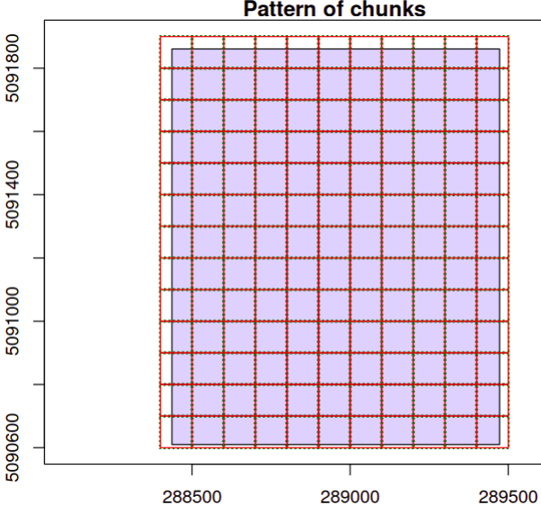

# Calcolo

Per l'elaborazione viene usato un calcolatore assemblato SuperMicro, con le seguenti caratteristiche:

::: list
-   CPU(s): 384

-   Model name: AMD EPYC 9654 96-Core Processor

-   CPU family: 25

-   Model: 17

-   Thread(s) per core: 2

-   Core(s) per socket: 96

-   CPU max MHz: 3707.8120

-   CPU min MHz: 1500.0000

-   BogoMIPS: 4800.10

-   Memory: total: 770 GiB
:::

### Area di studio

In figura sotto l'area di studio.

## Metodi

L'obiettivo è la segmentazione, realizzata in modalità semi-automatica, mediante la suddivisione dei punti in cluster sulla base delle loro caratteristiche distintive.

L'unità elementare usata per la segmentazione è il singolo punto nella nuvola di punti. L'ipotesi messa a verifica è che usando unicamente le informazioni rilevate dal sensore L2, senza l'ausilio di ulteriori informazioni di riflettanza e senza procedure di addestramento per identificare classi mediante esempi da inserire in un contesto di algoritmi di "machine learning", si possa dividere i punti in gruppi (cluster) utili ad una successiva classificazione o almeno ad una maggiore comprensione del territorio.

Il primo passaggio è stato quello di identificare un piano terreno classificando punti appartenenti al terreno su un set di punti ricampionato a circa 0.5 m di passo, tenendo il punto con valore Z minore. Questa nuvola di punti ricampionata è stata poi classificata per identificare i punti ground e Le informazioni utilizzate sono quelle delle variabili seguenti: la coordinata Z relativa al terreno (nZ), e 15 descrittori geometrici estratti mediante la libreria per R sviluppata ad hoc "[CloudGeometry](https://github.com/fpirotti/CloudGeometry)". Come descritto nella pagina GitHub dedicata, questa libreria estrae 15 descrittori di forma usando combinazioni di autovalori e componenti principali estratti dalle coordinate X, Y e nZ.

L'intera nuvola di punti viene divisa in qualche centinaio di quadri con un buffer di 1 m (vedi figura sotto).

I descrittori geometrici da un raggio intorno ad ogni punto di 0.50 m e 0.25 m vengono estratti usando un calcolo parallelo con 32 CPU alla volta su ogni quadro. I descrittori geometrici sono noti da letteratura e sono qui estratti con la libreria [R "CloudGeometry"](https://github.com/fpirotti/CloudGeometry) disponibile su Github. Questa libreria sfrutta la capacità di utilizzo del calcolo parallelo multi-CPU dei moderni calcolatori. Questo passaggio è fondamentale dato il numero elevato di punti e la necessità di considerare n punti intorno ad ogni punto considerato.

 

### Normalizzazione

I descrittori sono stati scalati e trasformati rispetto alla loro mediana ed alla loro deviazione calcolata mediante MAD (median absolute deviation) in quanto molti non seguono una distribuzione normale e questo approccio limita l'effetto di distribuzioni fortemente asimmetriche. L'espressione per trasformare il vettore $X$ di $i$ valori $X = \{x_1, x_2, ..., x_i\}$ è la seguente:

$$
z = \frac{x - \tilde{x}}{\text{MAD}(X)}
$$

$$  
\quad \text{dove} \quad \tilde{x} = \text{mediana}(X) 
$$

La segmentazione viene poi eseguita con il metodo K-means su queste variabili e sull'altezza normalizzata, ovvero rispetto al terreno.

### K-Means

K-Means sceglie casualmente i punti di inizio nello spazio ad n-dimensioni dove n = il numero di variabili (nel nostro caso 33, ovvero 30 metriche di geometria, 15 per ogni con raggio di 25 e 50 cm rispettivamente, e 3 dalla riflettanza della camera RGB integrata nel laser. Il metodo converge verso un minimo locale dei centroidi. Il numero di cluster è arbitrario e dovrebbe essere considerato come un parametro da regolazione. In questa prova vengono utilizzati 24 cluster. Il risultato è una matrice che contiene le assegnazioni ai cluster e le coordinate nello spazio n-dimensionale dei centri dei cluster in termini degli attributi originariamente selezionati. I centri dei cluster possono variare leggermente a ogni esecuzione, poiché questo problema è non-deterministico Polynomial-time hard).

## Risultati

I dati sono visibili online [QUI](https://www.cirgeo.unipd.it/pointclouds/sifetBenchmark2025/).

La nuvola dopo segmentazione è disponibile per download QUI.

## Discussione

Nel procedimento sono stati notati molti limiti nell'utilizzo di alcuni algoritmi implementati unicamente su R usando lidR e lasR. In primis lidR carica in un data.frame R i dati, ovvero in una struttura non ottimizzata. La libreria lasR invece utilizza quasi esclusivamente l'ambiente di memoria C++ dunque viene gestito meglio. Lastools invece sfrutta al meglio la capacità di calcolo parallelo, senza complicazioni dovute ad alcune strategie di condivisione della memoria utilizzate da R. Lastools viene lo stesso usato tramite R chiamando il programma con il comando system. L'utilizzo di alternative, per rendere il flusso di processo totalmente OS, è sicuramente da verificare, con adeguata attenzione all'implementazione di ogni singolo algoritmo per quanto riguarda l'utilizzo della memoria per ogni processo eseguito in parallelo.

Riguardo i descrittori geometrici, è utile riportare che questi sono disponibili anche in altri applicativi, come CloudCompare, ed anche nel recente sviluppo di lidR nel nuovo lasR ([Jean-Romain Roussel 2025](https://r-lidar.github.io/lasR/)), ma nel primo caso verrebbe richiesto un'integrazione tra applicativi differenti (R e CloudCompare), certamente possibile ma con aggiunta complessità, mentre nel secondo caso sono state testate le procedure ma non hanno l'implementazione interna per il calcolo parallelo che ha CloudGeometry, dunque i tempi di calcolo diventavano non compatibili (un file di 1e6 punti richiede 3 ore), e la gestione di eventuali elaborazioni parallele di più files non ha avuto successo, almeno dalle prove.
